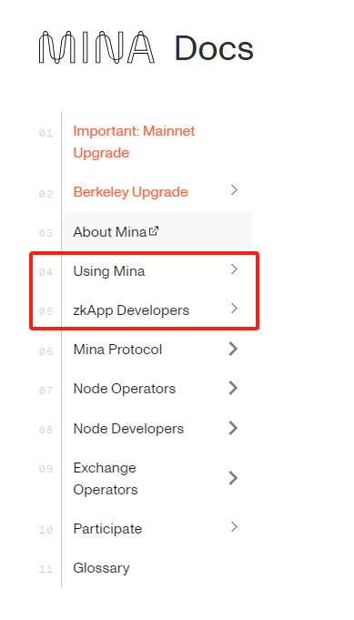

As The China Developer Ambassador of Mina, my mission is to help build and support the local developer community, promote Mina technology, and promote its adoption and development in China. In the next three months, I will make contributions to Mina's development in China by deeply learning and mastering Mina technology, **establishing localized resources**, **actively participating and organizing community activities**, **providing technical support and cooperation**, **using social media for promotion and publicity**, and **collecting and giving feedback to developers**.

## 《Stage I》
我计划在第一周完成主流媒体平台的账号开通（暂时以个人名义做推广）：
* 视频类：哔哩哔哩视频、YouTube
* 技术论坛博客类：微信公众号、CSDN、掘金、V2EX、知乎、Notion 和 SegmentFault 

## 《Stage II》
1. **Establish localized resources** (estimated workload: *60%+ in 3 months*)
*  Translate [Official Tech doc](https://docs.minaprotocol.com/)
    * Complete the doc translation (highlighted part, based on [doc git repo](https://github.com/o1-labs/docs2/)) in the First 2 weeks in June
        
        

* Translate the official blog of the last year and sync it to the online community (in the First 4 weeks in June)
    * https://minaprotocol.com/blog
    * https://blog.o1labs.org/tagged/o1js

* Output Chinese video tutorial to Bilibili/YouTube (_Effort is under estimation yet_)
    * [\<Starter Series\>](https://github.com/coldstar1993/Mina-ZkApp-Tutorials/blob/main/README.md#starter-series) coverring 12 videos （_expecting 1 video per week, under estimation!_）

2. **Community building and engagement** (estimated workload: 20% in 3 months)
* Build and manage online communities:
    * Manage the current wechat technical communication group, and share and answer technical questions in the group.
    * Synchronize/publish the translated documentation, tutorials, blogs on developer platforms such as CSDN, Nuggets, SegmentFault, and V2EX.

* Provide technical support:
    * Provide technical support for local developers who have questions while using Mina.
    * Create documentation to collect and summarize technical issues from community developers.

3. **Promotion and publicity** (estimated workload: 10% in 3 months)

* Use social media:
    * Publish news, event notifications, technology sharing and success stories about Mina on personal technology sharing accounts created on wechat, Zhihu and other social media platforms to enhance Mina's popularity and influence.

* Try to build links with well-known blockchain developer communities
    * Join **LearnBlockchain community**, **Rebase community**, **DappLearning community**, etc., jointly hold *Online Edu*, *Online Workshop*, *Offline Meetup*, etc.

* Try to establish links with university IT organizations and blockchain enthusiast communities
    * Introduce interested students to the Mina technical community

4. **Feedback and improvement** (estimated workload: 10% in 3 months)
* Gather feedback:
    * Regularly collect feedback and suggestions from local developers on Mina to understand their needs and challenges.
    * Pass feedback to Mina team to help improve and optimize products and services.

* Continuous improvement:
    * Continuously improve localization resources and support services based on developer feedback and needs.
    * Regularly evaluate the effectiveness of their own work, adjust and optimize promotion strategies and methods.